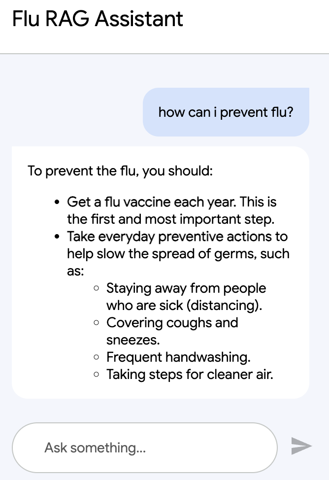
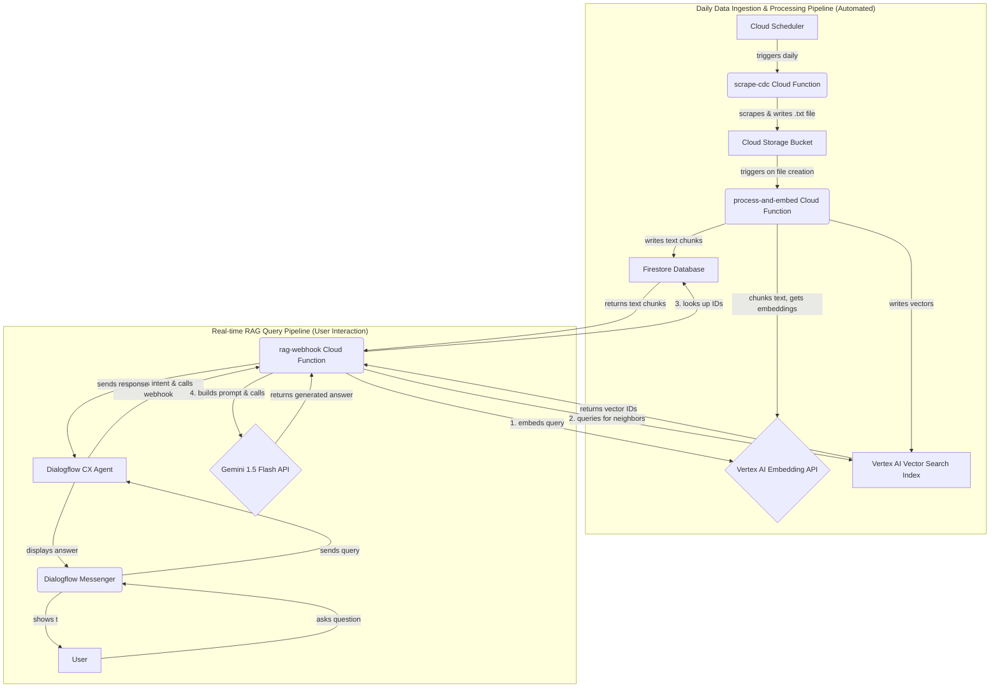

# AI Healthcare RAG Assistant

This project is a fully functional, end-to-end Retrieval-Augmented Generation (RAG) system built entirely on the Google Cloud Platform. It features a conversational AI agent, powered by Dialogflow CX and Google's Gemini models, that can answer user questions about public health topics (specifically, the flu) based on real, up-to-date information scraped from the Centers for Disease Control and Prevention (CDC) website.

The entire system is serverless, event-driven, and designed to be a low-cost, scalable solution for providing factual, AI-driven answers from a trusted knowledge base.

## Features

* **Conversational AI Interface:** Users can interact with the assistant in natural language through a simple web chat widget.
* **Automated Data Ingestion:** A Cloud Scheduler job runs daily to trigger a web scraping function, ensuring the knowledge base stays current.
* **Sophisticated RAG Pipeline:**
    * **Retrieval:** Uses Vertex AI Vector Search to find the most semantically relevant text chunks from the knowledge base.
    * **Augmentation:** Retrieves the full text of relevant chunks from a Firestore database.
    * **Generation:** Uses the powerful Gemini 1.5 Flash model to synthesize a helpful, conversational answer based *only* on the retrieved factual context.
* **De-duplication Logic:** The data pipeline intelligently overwrites existing data, preventing the accumulation of duplicate information from daily scrapes.
* **Production-Ready Publishing:** The Dialogflow agent is configured with separate "Draft" and "Production" environments, following best practices for safe deployment and testing.

## Chatbot UI

  

## Architecture

The project is composed of two main asynchronous workflows: a daily data ingestion pipeline and a real-time query pipeline.

## Technology Stack

### Google Cloud Platform Services

* **Compute:** Google Cloud Functions (Gen 2)
* **AI / ML:**
    * Vertex AI Vector Search (for semantic retrieval)
    * Vertex AI Text Embedding Model (`text-embedding-004`)
    * Vertex AI Generative AI Model (`gemini-1.5-flash-001`)
* **Conversational AI:** Dialogflow CX
* **Storage:**
    * Google Cloud Storage (for raw text files)
    * Firestore (for the text chunk knowledge base)
* **Automation & Ops:**
    * Cloud Scheduler (for cron jobs)
    * Cloud Build (for deployments)
    * Cloud Run (underlying service for Gen 2 Functions)
    * IAM (for service accounts and permissions)
    * Cloud Logging (for debugging)

### Key Python Libraries

* `functions-framework`
* `google-cloud-firestore`
* `google-cloud-storage`
* `google-auth`
* `requests`
* `beautifulsoup4`

## The Journey: A Note on Real-World Debugging

This project was not a simple "hello world" tutorial. Its development was an extensive, multi-day exercise in real-world cloud engineering and debugging that reflects the true challenges of building on cutting-edge platforms.

The process involved methodically diagnosing and solving a series of deep, often undocumented, platform-level issues, including:

* **Persistent Container Startup Failures:** Debugging `Container Healthcheck failed` errors by fixing IAM permissions, memory allocation, code structure (lazy initialization), and dependency conflicts.
* **Platform API Bugs:** Navigating and creating workarounds for Vertex AI service endpoints that were not behaving as documented (`404 Not Found` and `501 Not Implemented` errors). This led to the critical discovery of using dedicated `.vdb` hostnames for Vector Search queries and the correct payload format for the Gemini API.
* **Complex IAM Issues:** Correctly identifying and permissioning multiple, distinct service agents (Cloud Functions runtime, Eventarc, Cloud Storage) to allow them to interact securely.
* **Evolving UIs:** Adapting to constant changes in the Google Cloud Console for services like Dialogflow CX, including finding non-obvious procedural workflows for publishing and integration.

This project is a testament to a persistent, methodical, and deeply technical approach to problem-solving in a modern cloud environment.

## Setup & Deployment

1.  **Prerequisites:** A Google Cloud project with billing enabled, `gcloud` CLI installed and authenticated, Python 3.11+ and a virtual environment.
2.  **Enable APIs:** Enable all the GCP services listed in the technology stack.
3.  **Configure Infrastructure:**
    * Create a GCS bucket.
    * Create a Firestore database in Native Mode.
    * Create a Vertex AI Vector Search Index and Index Endpoint.
4.  **Deploy Functions:** Deploy the three Cloud Functions (`scrape-cdc`, `process-and-embed`, `rag-webhook`) using the `gcloud functions deploy` command, ensuring all necessary environment variables are set.
5.  **Configure Dialogflow:**
    * Create a Dialogflow CX agent.
    * Create the necessary intents and configure the webhook fulfillment.
    * Publish a version and create a `Production` environment.
6.  **Integrate:** Set up the Dialogflow Messenger integration, point it to the `Production` environment, and embed the final HTML code into a webpage.

## Future Improvements

* **Incorporate More Data Sources:** Scrape additional public health resources (e.g., from the WHO) to enrich the knowledge base.
* **Advanced De-duplication:** Implement a content-hashing strategy in the scraper to only trigger the processing pipeline when the source documents have actually changed.
* **Conversation History:** Add memory to the Dialogflow agent to allow for follow-up questions.
* **Streaming Responses:** Modify the webhook to stream the response from Gemini for a more interactive, real-time user experience.